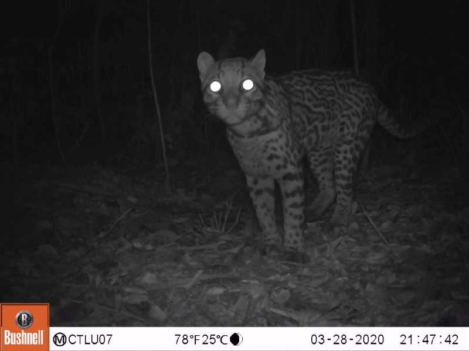
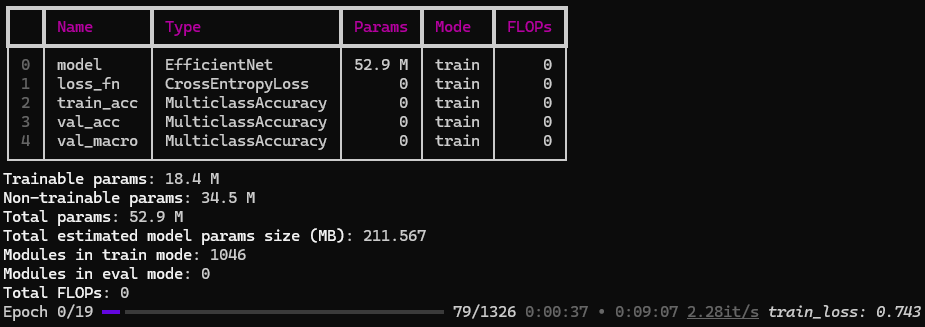

# SpeciesNet fine-tuning tutorial

## Table of contents

[**Overview**](#overview)  
&nbsp;&nbsp;[Goals of this tutorial](#goals-of-this-tutorial)  
&nbsp;&nbsp;[Special thanks](#special-thanks)  
&nbsp;&nbsp;[Consider using AI to take it from here](#consider-using-ai-to-take-it-from-here)  
&nbsp;&nbsp;[What to expect from species classification, and when fine-tuning is/isn't worth it](#what-to-expect-from-species-classification-and-when-fine-tuning-isisnt-worth-it)  
&nbsp;&nbsp;[How much data do I need?](#how-much-data-do-i-need)  
&nbsp;&nbsp;[Sample data](#sample-data)  
&nbsp;&nbsp;[Steps in this tutorial](#steps-in-this-tutorial)  
[**Setting up your environment**](#setting-up-your-environment)  
[**Preparing your data**](#preparing-your-data)  
&nbsp;&nbsp;[The format this tutorial expects](#the-format-this-tutorial-expects)  
&nbsp;&nbsp;[Why camera locations matter](#why-camera-locations-matter)  
&nbsp;&nbsp;[How filenames are resolved](#how-filenames-are-resolved)  
&nbsp;&nbsp;[Creating your data .csv file](#creating-your-data-csv-file)  
[**Running MegaDetector on your images**](#running-megadetector-on-your-images)  
[**Preparing a mapping file**](#preparing-a-mapping-file)  
&nbsp;&nbsp;[Why you might remap your categories](#why-you-might-remap-your-categories)  
&nbsp;&nbsp;[The mapping CSV format](#the-mapping-csv-format)  
&nbsp;&nbsp;[Generating a template mapping file](#generating-a-template-mapping-file)  
[**Fine-tuning**](#fine-tuning)  
&nbsp;&nbsp;[What you need](#what-you-need)  
&nbsp;&nbsp;[Starting a fine-tuning run](#starting-a-fine-tuning-run)  
&nbsp;&nbsp;[Fine-tuning options](#fine-tuning-options)  
&nbsp;&nbsp;[What a fine-tuning run produces](#what-a-fine-tuning-run-produces)  
&nbsp;&nbsp;[Resuming an interrupted run](#resuming-an-interrupted-run)  
&nbsp;&nbsp;[Choosing how much to fine-tune](#choosing-how-much-to-fine-tune)  
[**Running your fine-tuned model**](#running-your-fine-tuned-model)  
&nbsp;&nbsp;[Inference options](#inference-options)  
&nbsp;&nbsp;[The default output file (MegaDetector format)](#the-default-output-file-megadetector-format)  
&nbsp;&nbsp;[The csv output format](#the-csv-output-format)  
[**Working with your results**](#working-with-your-results)  
[**Evaluation tips**](#evaluation-tips)  
[**Future work**](#future-work)  
[**Topics that aren't very interesting**](#topics-that-arent-very-interesting)  

## Overview

### Goals of this tutorial

[SpeciesNet](https://github.com/google/cameratrapai/) is an AI model that classifies species in camera trap images.  SpeciesNet was trained on around 2,500 categories (mostly species, but also some higher-level taxa) from a [variety of global geographies](https://github.com/google/cameratrapai/blob/main/model_cards/v4.0.1a.md#country-distribution).  2,500 is a lot, but it's just a fraction of the species that are monitored with camera traps, so in some scenarios, users might benefit from a local model that "knows" the species in a particular study area.

While it's possible to train a regionally-specific model from scratch, using SpeciesNet as a starting point can significantly reduce the amount of data required to train a new classifier.  However, using SpeciesNet as a starting point doesn't make it <i>easier</i> to train a new model (in terms of technical complexity), it just reduces the amount of training data required.  The goal of this tutorial is to guide a user through the process of creating a fine-tuned version of SpeciesNet on your own data.

This tutorial will ask you to set up a Python environment so you can run the code from this repo, but you won't need to <i>write</i> any code.

If you have any questions or feedback about this tutorial, or you get stuck, or anything here is just outright wrong, <a href="mailto:agentmorris@gmail.com">email me</a>!

### Special thanks

This tutorial builds on the amazing work of [Peter Bull](https://www.linkedin.com/in/pjbull), who ported the SpeciesNet weights to a fine-tuning-friendly container.  See his [speciesnet-convert](https://github.com/pjbull/speciesnet-convert) repo for more information.  That work was in support of the [Zamba Cloud](https://www.zambacloud.com/) platform, a no-code tool that allows you to, among other things, train a custom model.  If your goal is to train a custom model, and you don't specifically need to use SpeciesNet, you might consider skipping this tutorial and instead trying Zamba Cloud.

### Consider using AI to take it from here

Another way of looking at this tutorial is that it helps guide a user's <i>agent</i> through the process of creating a fine-tuned version of SpeciesNet.  So rather than reading this entire tutorial, consider opening a command-line AI tool - e.g. [Antigravity CLI](https://antigravity.google/product/antigravity-cli), [Claude Code](https://code.claude.com/docs/en/overview), or [Codex CLI](https://developers.openai.com/codex/cli) - on the computer where your data lives, and saying something like this:

> I want to review my camera trap images as efficiently as possible.  My images are in c:\my-images.  Visit https://github.com/agentmorris/speciesnet-finetuning, read the README, talk to me about whether fine-tuning SpeciesNet on my data is likely to be helpful.  If we decide to proceed - walk me through the process of fine-tuning.

Whether you're a human who is still reading or an agent whose human asked you to read this tutorial, welcome.

### What to expect from species classification, and when fine-tuning is/isn't worth it

In general, AI is not yet ready to fully automate most camera trap review workflows (not just SpeciesNet, this is true for any AI model).  If your focal species is a rare small cat, and you have other small cats in your study area that look similar, you probably don't want to trust AI to differentiate one small cat from another.  But that doesn't mean that AI can't help you!  IMHO too many users bail on AI because it doesn't perform as well as they like on rare species.

For most users, the benefit of AI comes from <i>getting you through your common classes quickly</i>, so you can focus your time and expertise on the species that are important and/or difficult.  I.e., think of AI as helping you separate "images you need to look at" from "images you don't need to look at".  If you are studying rare cats, but 75% of your images are blank, and another 15% of your images are cattle, AI can save you <i>lots</i> of time - by letting you auto-accept or very quickly review the blanks and cattle - even if it's <i>terrible</i> at differentiating your rare cats, <i>as long as it doesn't call your rare cat images blanks or cattle</i>.

In machine learning terminology, AI can help you as long as it has <i>very high precision</i> and <i>adequate recall</i> on your common classes.  I.e., if cattle is your most common class, it's <i>not</i> OK to call your rare cats "cattle" (because you're not going to look at those images), but it's fine to call a few cattle images "unknown", or "mammal", or even "cat" (because you're going to look at those images anyway).

So AI-based species classification is most likely to be helpful if you have common, easy species you don't want to spend a lot of time on.  If all of your classes are equally common and equally important, unless AI is nearly perfect (which isn't really a thing), species classification is less likely to be helpful.

#### When fine-tuning might <i>not</i> be worth it

* **If SpeciesNet is already very good at your common species, fine-tuning might not be worth it**.  If AI species classification is most helpful for helping you avoid spending time on common, easy species, this also means that even if SpeciesNet doesn't know about your focal species, it might not be worth the hassle of fine-tuning, <i>as long as SpeciesNet has very high precision on your common classes</i>.  Maybe you would get better accuracy on your rare classes if you fine-tuned on your own data, and maybe you wouldn't, but in many scenarios, even if fine-tuning <i>does</i> improve accuracy, it won't save you any more time than the non-fine-tuned version.  E.g. if you are studying lynx in an area where you also have bobcats, and most of your images are blanks and cattle, maybe fine-tuning will get you 5% more accuracy differentiating bobcat from lynx, but this doesn't help you <i>at all</i> if you're going to look at all of those bobcat/lynx images anyway.

* **If SpeciesNet doesn't know about some of your species, but it consistently classifies them as some other species, fine-tuning is almost definitely not the ideal solution**.  E.g. if you have a lot of European red deer in your study area, and SpeciesNet consistently classifies them as elk (which don't co-occur with red deer), it's <i>much</i> easier to just re-map all the "elk" predictions to "red deer" than to fine-tune.  More on this kind of re-mapping below, in the "what might I try before fine-tuning?" section.

* **If MegaDetector doesn't detect your animals well in the first place, fine-tuning SpeciesNet won't help**.  SpeciesNet depends on [MegaDetector](https://github.com/agentmorris/MegaDetector) to find animals, so if MegaDetector fails to find some of your animals, SpeciesNet never sees them, and fine-tuning SpeciesNet can't "rescue" those missed animals.  For example, semi-aquatic mammals that are partially submerged (e.g. beavers, otters, nutria, etc. with just their heads sticking out of the water) are a struggle for MegaDetector, and fine-tuning SpeciesNet won't help you recover those animals.

* **If <i>humans</i> can't easily tell your species apart, AI can't either**.  A good guideline for the ceiling of what you can ask of AI is that with lots of data, a computer vision model can distinguish species that you could teach a wildlife novice to distinguish with a few minutes of training.

#### When fine-tuning is likely worth it

* **If you have common, easy-to-see species that are not in SpeciesNet's training data and don't look exactly like something in SpeciesNet's training data, fine-tuning might help**.  For example, SpeciesNet does not have a "polar bear" class, and does not consistently classify polar bears as any other specific class.  I.e., SpeciesNet might very well lump your polar bears in with a more common class, so if you have polar bears in your data, SpeciesNet can't really save you time.  Fine-tuning SpeciesNet is likely to be helpful in this case, even if polar bears are rare.  This is true for any scenario where you have an important class that is generally easy to see, but doesn't look anything like what SpeciesNet knows about.

* **If you are one of the lucky few who is within "striking distance" of full automation, and that little bit of improvement you might see on rare classes could be the difference between reviewing images and trusting high-confidence AI predictions entirely, fine-tuning might be worth it**.  This is rare!  This is typically a case where you have very few categories that are easily confused with each other, and a <i>relatively</i> high tolerance for a few mistakes.  E.g. maybe your primary goal is to count livestock species, and you find that SpeciesNet is <i>almost good enough</i> at this task in your images to do this with no human review.  If this is your scenario, fine-tuning might be worth it.

#### What might I try before fine-tuning?

* **Try other models**. SpeciesNet is great (in my super-biased opinion), but it's not the only game in town.  If there's another classifier whose training distribution matches your species distribution pretty well, try that before fine-tuning.  I try to keep track of publicly-available species classification models [here](https://agentmorris.github.io/camera-trap-ml-survey/#publicly-available-ml-models-for-camera-traps).

* **Get the most out of "vanilla SpeciesNet"**. In particular, many issues that might make fine-tuning seem like a good option can be resolved by just remapping SpeciesNet's outputs differently, instead of using the standard SpeciesNet geofence (a list of taxa that are allowed in each country (or US state)).  You can do this with the <a href="https://megadetector.readthedocs.io/en/latest/postprocessing.html#megadetector.postprocessing.classification_postprocessing.restrict_to_taxa_list">restrict_to_taxa_list</a> function, which takes a list of SpeciesNet taxa in a .csv file, and maps them to whatever labels you want.  In addition to mapping one species to another, you could, for example, map all birds that aren't otherwise mapped to an "other bird" label.  This [skill](https://github.com/agentmorris/agentmorrispublic/blob/main/skills/speciesnet-taxonomy-mapping/SKILL.md) or this [app](http://dmorris.net/speciesnet-taxonomy-mapper) can help you make those .csv files.  More generally, I have some "pro tips" for getting the most out of MegaDetector and SpeciesNet [here](http://lila.science/speciesnet-pro-tips).

* **Invest in workflow efficiency**.  Remember that the goal of processing your camera trap images with AI is to save you (ecologists) time, and in many cases the best hour that you can invest in saving yourself time isn't fine-tuning an AI model, it's increasing the efficiency of your workflow in ways that have nothing to do with AI.  Are you using the mouse to move between images and assign species?  If so, I recommend moving to the keyboard.  Do you know all the keyboard shortcuts in whatever tool you use to review images?  If not, I recommend learning them (and practicing them) before fine-tuning an AI model.  Are you tagging species in an Excel spreadsheet?  That's OK, but it's not optimal, and you might find that learning to use an image review tool like [Timelapse](https://timelapse.ucalgary.ca/) gives you a bigger efficiency boost than you would get from investing time in fine-tuning a model.  All of these things are dull, but at least as important as AI accuracy in terms of making a camera trap workflow efficient.

All that said, there are lots of good reasons to fine-tune your own model, so if I haven't talked you out of fine-tuning, read on!

### How much data do I need?

There's no easy answer to this; if you can predict the relationship between the amount of training data someone has and the accuracy they'll see after training a model, you can have a free PhD in computer science.  But as a very general rule, I wouldn't bother training a category with less than 100 training examples that are pretty distinct (i.e., the same deer standing in the same place in the same sequence of ten images is more like one training sample).  "Low-single-digit thousands" of examples per category would be more comfortable for fine-tuning.  "High-single-digit thousands" would be more comfortable for training from scratch.  All of these numbers depend on how distinctive your species are: a species with bright stripes, or a species that looks nothing like any of your other species, might be fine with 100 examples.  If you have two rodents that can be distinguished, but not easily, maybe those need more like 1000 examples each.

So, consider grouping together categories that are very small in terms of training examples, e.g. if you have 50 different songbirds with 10 examples each, I wouldn't try to train a category on each one; consider lumping them into an "other songbird" category (more later on how to do this).

Because we will be training on animals that are cropped out of their original images with MegaDetector, if you have a group of four elephants in an image, that "counts" as four examples.

### Sample data

Throughout this tutorial, I am going to use the [Orinoquía Camera Traps](https://lila.science/datasets/orinoquia-camera-traps/) dataset as an example.  You likely want to work with your own data, but if you want to follow along, start by downloading the data from that page:

* [Zipfile of all the images](https://storage.googleapis.com/public-datasets-lila/orinoquia-camera-traps/orinoquia_camera_traps_images.zip)
* [Zipfile of the metadata](https://storage.googleapis.com/public-datasets-lila/orinoquia-camera-traps/orinoquia_camera_traps_metadata.zip)

This dataset contains around 100k images; for this tutorial, we will be ignoring the ~20k empty images.

At each step in the tutorial, there will be a heading called "applying this to the sample data", where I link to a file that was created for that step using this dataset.

Gratuitous image from this dataset to keep your attention:



### Steps in this tutorial

This is basically what's going to happen in the rest of this tutorial:

1. Setting up your environment: cloning this repository, installing Python, etc.
2. Getting your data into the format the tutorial code needs to figure out which images contain which species.
3. Running [MegaDetector](https://github.com/agentmorris/MegaDetector) on your images.
4. Creating your fine-tuned model.
5. Running your fine-tuned model.

## Setting up your environment

The instructions in this tutorial will assume two things:

1. This tutorial assumes that you have cloned this GitHub repository to your computer.  Rather than taking up lots of space here describing all the ways one might install git, I'm going to punt this one to AI: if you have never cloned a git repo before or you're not sure whether you have git installed, ask AI.

2. This tutorial assumes that you have a Python environment set up.  For folks new to Python, we recommend installing [Miniforge](https://github.com/conda-forge/miniforge), a free tool for managing Python environments.  Consider following the "[Setting up a Python environment](https://github.com/google/cameratrapai/blob/main/installing-python.md)" instructions from the SpeciesNet repo, which will walk you through installing Miniforge.

Assuming you've installed Miniforge and git, and cloned this repo to a folder on your computer, start a  Miniforge prompt, then cd into that folder like this:

`cd c:\git\speciesnet-finetuning`

Any folder is fine, I'm just using that as an example.

Then create a new Python environment for this tutorial, like this (any environment name is fine, I'm just using "speciesnet-finetuning" as an example):

`mamba create -n speciesnet-finetuning python=3.12 pip -y`

That command says "create a new Python environment called 'speciesnet-finetuning' that has Python version 3.12, and install the 'pip' package inside that environment".

Then activate that environment like this:

`mamba activate speciesnet-finetuning`

...and install all the libraries this tutorial depends on, like this:

`pip install -r requirements.txt`

That was a lot of random Python gibberish, I know, but if anything goes wrong, feel free to <a href="mailto:agentmorris@gmail.com">email me</a> with questions, or ask AI!  If you ask AI questions about setup stuff, consider pointing it to this README so it has the context of what we're trying to do.

## Preparing your data

### The format this tutorial expects

This tutorial does not require any particular organization of your files on disk.  Instead, you will describe your dataset with a .csv file with one row per labeled image, and the following three columns:

| Column | What it contains |
|---|---|
| `filename` | The path to one image (see "how filenames are resolved" below). |
| `category` | The label for that image... this is usually a taxon (`zebra`, `impala`, `rodent`) or a non-taxonomic label like `blank`, but it can also include any other class you want the model to learn. |
| `location` | The camera (aka "deployment" or "site") the image came from.  This is not latitude and longitude, just a unique name for each camera. |

A minimal CSV looks like this:

```csv
filename,category,location
A01/01100085.JPG,black_agouti,A01
A01/01140096.JPG,collared_peccary,A01
A01/01140097.JPG,empty,A01
A01/01290101.JPG,spixs_guan,A01
```

Two things to know about this format:

* **An image can appear in more than one row.**  If a single photo contains both a black agouti and an collared peccary, it can have a `black_agouti` row and an `collared_peccary` row.
* **The class names are entirely up to you.**  Whatever you put in the "category" column will be what your fine-tuned model predicts.

### Why camera locations matter

A camera trap dataset of 1,000,000 images might come from only ~200 cameras, and the images from a single camera are highly repetitive (same background, same lighting, often the same individual animals passing repeatedly). If you let images from one camera land in both your training and validation sets, your validation accuracy will look great, but won't reflect how your model will perform in the real world.

So the right thing to do is to split the data by camera: every image from a given camera goes entirely into training *or* entirely into validation, never both.  Code that you will use later in this tutorial does that splitting for you, but to do it, it needs to know which images share a camera.  That is the only reason the `location` column exists.  You don't have to think about the splitting itself; you just have to provide the location for each image.

If you genuinely have no camera/location information, you can put the same value (e.g. `unknown`) in every row, but in that scenario, take your validation numbers with a grain of salt.

### How filenames are resolved

For the examples we provide in this section, let's imagine we have the following image files:

* c:/my_images/camera001/image001.jpg
* c:/my_images/camera002/image001.jpg

The `filename` value in a row in the .csv file can be any of the following:

* **Filename relative to the csv file's location**.  For example, if your .csv file is in "c:/my_images", "camera001/image001.jpg" is a valid value for `filename`.
* **Relative to an image root** that you pass in separately.  For example, you can put your .csv file in a random folder, and specify --image-root as "c:/my_images", and in that case, "camera001/image001.jpg" is a valid value for `filename`.
* **An absolute path** (e.g. "c:/my_images/camera001/image001.jpg").

### Creating your data .csv file

Everyone's data is in a different format, so we can't provide universal guidelines for preparing your .csv file.  As long as you can get your data into the above format (a .csv with `filename`, `category`, and `location` columns), everything in the rest of this tutorial is agnostic to how you made that file.  If you would like help getting your data into that format, feel free to <a href="mailto:agentmorris@gmail.com">email me</a>.  But also, this is a great task for AI: if you describe how your data is organized and point AI to this page, it will have no trouble creating a .csv file that follows the format described above.

#### If your data is already in COCO Camera Traps format

[COCO Camera Traps](https://github.com/agentmorris/MegaDetector/blob/main/megadetector/data_management/README.md#coco-camera-traps-format) (CCT) is a common format for camera trap labels among machine-learning-y types, e.g., this is where you'll start if you are creating a fine-tuned model based on data from [LILA](https://lila.science/category/camera-traps/). If your labels are in a CCT .json file, the script `scripts/coco_to_csv.py` produces the CSV for you. Your CCT file must have a `location` field on every image (the script will stop with a clear error if any image is missing one).

You can run the script like this (assuming you cloned this repo to `c:\git\speciesnet-finetuning` and created a Python environment called `speciesnet-finetuning`):

```bash
cd c:\git\speciesnet-finetuning
mamba activate speciesnet-finetuning
python scripts/coco_to_csv.py path/to/labels.json path/to/output.csv
```

Replace "path/to/labels.json" with the location of your COCO Camera Traps .json file, and replace "path/to/output.csv" with the location where you want to write the new .csv file.

The options:

| Option | Default | What it does |
|---|---|---|
| `--multiple-label-handling` | `omit` | What to do with images that have more than one distinct category. `omit` drops them; `all` writes one row per category. |
| `--unlabeled-image-handling` | `omit` | What to do with images that have *no* label at all. `omit` drops them; `error` stops so you can investigate; `include` keeps them, labeled as `unlabeled`. |
| `--image-folder` | (none) | The folder your images live in. Only needed for `--image-verification` or `--absolute-paths`. |
| `--absolute-paths` | off | Write absolute image paths instead of the paths as they appear in the JSON. Requires `--image-folder`. |
| `--image-verification` | (none) | Check that every referenced image exists on disk before writing. `error` stops without writing the CSV if any are missing; `omit` drops the rows whose image is missing; `warning` keeps every row. `omit` and `warning` both report the count of missing images. Requires `--image-folder` (unless `--absolute-paths` is set). |

The default value for `--multiple-label-handling` is `omit`, which throws away any image that contains more than one category.  This is because we have no way to determine which animal in the image goes with which category.

#### Applying this to the sample data

I ran `coco_to_csv.py` on the .json file for Orinoquía Camera Traps (our sample dataset), the resulting .csv file is [here](https://lilawildlife.blob.core.windows.net/lila-wildlife/previews/speciesnet-finetuning-tutorial/orinoquia-20260624/orinoquia_camera_traps.json.csv), with one row per label (around 100k rows total).

## Running MegaDetector on your images

SpeciesNet relies on [MegaDetector](https://github.com/agentmorris/MegaDetector) to *find* animals, before SpeciesNet can classify them.  Fine-tuned versions of SpeciesNet work the same way.  Consequently, before you can create a fine-tuned model on your data, you need to run MegaDetector on your data.

There are a number of ways to run MegaDetector, so it's not the best use of space in this already-long README file to tell you how to run MegaDetector.  All that this tutorial cares about is that you end up with a file in the [MegaDetector output format](http://lila.science/megadetector-output-format) that points to the same images your .csv file points to.  Typically that means running MegaDetector on the root folder where all your images are.

The two most common ways to run MegaDetector are:

* Using [AddaxAI](https://addaxdatascience.com/addaxai/), a free, graphical tool for running AI models on camera trap images
* Following the instructions [here](https://github.com/agentmorris/MegaDetector/blob/main/megadetector.md#using-megadetector) to run MegaDetector at the command line (with the [MegaDetector Python package](https://megadetector.readthedocs.io/))

Both approaches produce the right file format.

#### Applying this to the sample data

I cheated for the sample data for this step, because I've already run MegaDetector for [every dataset on LILA](https://lila.science/megadetector-results-for-camera-trap-datasets/).  The specific MegaDetector results file I used is [here](https://lila.science/public/lila-md-results/orinoquia-camera-traps_public_mdv5a.0.0_results.filtered_rde_0.150_0.850_10_0.200.json.zip).  But if I hadn't already run MD on this data, I would have used AddaxAI.

## Preparing a mapping file

A mapping file is an optional .csv file that renames, merges, or drops some of your categories at training time.  It is kept separate from your data .csv on purpose: the data .csv is a literal record of your labels, while the mapping captures decisions related to model training, so you can try different groupings without editing your data.

### Why you might remap your categories

Common reasons:

* **The same animal is labeled two ways.** For example `wildebeest` and `blue_wildebeest`, or a misspelling sitting alongside the correct spelling.  Map them to one name so they count as a single class.
* **Some of your labels capture nuances you don't want the model to learn** (or don't have enough data to learn).  Sex or age labels like `lion`, `lion_male`, `lion_female`, and `lion_cub` might be better merged into `lion`, unless you have enough examples of each to train separate categories (and they're relatively easy to distinguish).
* **Some classes are too rare or too hard to tell apart.** A long tail of bird species with a handful of images each will not train well individually.  Merging them into a coarser class like `other_bird` (or `rodent`, `reptile`, etc.) usually yields a more useful model.
* **Some labels are not real classes.** A catch-all like `animal`, or a label like `unknown`, can often be dropped entirely.

You aren't required to remap anything: if you skip the mapping file, every category that appears in your .csv file (above a minimum count that you'll specify in the next step) is trained as its own class.

### The mapping CSV format

The mapping .csv has two columns that matter: `input` and `output`.  Any other columns, such as the `count` column described below, are ignored.

Here is an example of what a mapping .csv file looks like:

```csv
input,output
black_agouti,agouti
collared_peccary,
orinoco_agouti,agouti
empty,remove
human,remove
spotted_paca,
rodent,
white-lipped_peccary,
```

The `output` column decides what happens to each `input` category:

* **A name** renames the category; several inputs sharing one output are merged (so `black_agouti` and `orinoco_agouti` above both become `agouti`).
* **The word `remove`** drops the category entirely; its images contribute nothing to training (so we are dropping the `human` and `empty` labels in the example above).
* **If the output column is left blank**, the category is unchanged, which is identical to not listing it at all.  For example, the `spotted_paca` row above is just documentation; you could delete it and `spotted_paca` would still be its own category.

Two rules: each `input` may appear only once, and the mapping is applied in a single pass, so if you map `A` to `B` and also `B` to `C`, an `A` becomes `B`, not `C`.

### Generating a template mapping file

You can write the mapping .csv by hand, but if your labels are in COCO Camera Traps format, it may be easier to start from a generated template.  `scripts/coco_to_mapping_file.py` lists every category for you, sorted from most to least common, with the `output` column left blank to fill in:

```bash
python scripts/coco_to_mapping_file.py path/to/labels.json mapping.csv
```

The result has one row per category (plus a row for `unlabeled`, the images with no annotations, which is always included) and a `count` column giving the number of images that contain that category:

```csv
input,output,count
collared_peccary,,24784
empty,,20334
black_agouti,,14206
human,,7441
unknown_bird,,5766
unknown_armadillo,,5732
...
coiban_agouti,,1
giant_otter,,1
unknown_tayra,,1
```

The `count` column will be ignored in the training process, but it may be helpful when you're deciding what to merge or drop; the long tail at the bottom is where merging into coarser classes usually helps.  Then fill in the `output` column and pass the file to training with `--mapping` (see "Fine-tuning").

One caveat about `count`: it is the number of *images* per category, which is a useful guide, but the model actually trains on MegaDetector crops, so the number of training examples per class will differ.

#### Applying this to the sample data

[Here](https://lilawildlife.blob.core.windows.net/lila-wildlife/previews/speciesnet-finetuning-tutorial/orinoquia-20260624/orinoquia_camera_traps.json.mapping.csv) is a .csv file that maps the 51 categories in the Orinoquía Camera Traps dataset to a smaller number of categories.  There are some decisions involved at this step: for example, because there are 14k black agouti examples in the dataset, and a total of four examples (not 5k, literally four) of "Orinoco agouti" and "coiban agouti", I mapped all of those categories to a new category called "agouti".  That doesn't mean a user of this model doesn't care about the distinction between black agoutis and coiban agoutis, it just means that's not a distinction that AI can help with.  I also made a decision not to use the "empty" category (we will rely on MegaDetector to eliminate blanks), and I merged a bunch of classes into "other_mammal".  There's no formula for doing this, it depends on your dataset and your goals.

## Fine-tuning

Fine-tuning takes the SpeciesNet classifier and continues training it on your own labeled crops, so it learns the species in your study area (and your label names) instead of SpeciesNet's full taxonomy.  The training script does three things for you: it turns your data into training crops, it splits your cameras into training and validation sets, and it trains the model.  All the output related to training gets put into a single folder that we'll call the "run folder".

By default, each labeled image becomes one training example per MegaDetector animal box (up to five boxes per image, at confidence 0.3 or higher; see `--max-boxes` and `--conf-threshold`), and each crop inherits its image's label.  This is the same "classify the animal box" approach SpeciesNet itself uses.  One consequence is worth understanding: an image with no animal box above the threshold produces no training crops, so most `blank` images contribute nothing.  A crop-based classifier only learns `blank` from MegaDetector's false-positive boxes, which is expected.

### What you need

Before fine-tuning you should have:

* **A data CSV** with `filename`, `category`, and `location` columns (see "[preparing your data](#preparing-your-data)").
* **A MegaDetector results file** covering those images (see "[running MegaDetector on your images](#running-megadetector-on-your-images)").
* **Optionally, a mapping file** to rename, merge, or drop classes (see "[preparing a mapping file](#preparing-a-mapping-file)").

### Starting a fine-tuning run

A minimal run looks like this:

```bash
python scripts/train.py \
    --data-csv c:/path/to/your/data.csv \
    --image-root c:/path/to/your/images \
    --md-results c:/path/to/your/megadetector_results.json \
    --mapping c:/path/to/your/mapping_file.csv \
    --run-folder c:/path/to/your/output/folder
```

`--run-folder` is required and must not already exist; everything from the run is written there.

The script prints a running summary, and when it finishes it writes the fine-tuned model to `c:/path/to/your/output/folder/model_best.pt`.

The training script will download the SpeciesNet weights from this repository; if you've already downloaded them, you can use the `--backbone-checkpoint` option to point the training script to the file you want to start training from.

### Fine-tuning options

Run `python scripts/train.py --help` for the complete list; these are the ones most worth knowing:

| Option | Default | What it does |
|---|---|---|
| `--mapping` | (none) | Mapping CSV to rename, merge, or drop classes (see "Preparing a mapping file"). |
| `--min-instances` | `100` | Drop any class with fewer than this many training crops (counted after mapping). |
| `--val-fraction` | `0.15` | Target fraction of crops to hold out for validation (chosen by camera). |
| `--conf-threshold` | `0.3` | Minimum MegaDetector confidence for a box to become a training crop. |
| `--max-boxes` | `5` | Maximum animal boxes to use per image (highest confidence first). |
| `--epochs` | `20` | Number of passes over the training data. |
| `--unfreeze-blocks` | `2` | How much of the backbone to train: `0` = the new head only, `N` = the head plus the last N of the backbone's 7 stages, `-1` = the whole network. |

These are the ones you can probably leave at their defaults, but you might tinker with them if you've trained a model and you want to experiment with different parameters, or you have trouble getting training running:

| Option | Default | What it does |
|---|---|---|
| `--weighted-loss` | off | Weight the loss by inverse class frequency, to help rare classes. |
| `--batch-size` | `32` | Crops per step, per GPU. |
| `--lr` | `1e-4` | Learning rate. |
| `--workers` | `8` | Data-loading worker processes, per GPU. |
| `--checkpoint-every-n-epochs` | `1` | How often to save a checkpoint (every epoch by default). |
| `--patience` | `0` | If greater than 0, stop early when validation macro-accuracy has not improved for this many epochs. |
| `--devices` | `auto` | `auto` uses all GPUs; or give an integer count. |
| `--seed` | `0` | Random seed (this also determines the train/val split). |

### What a fine-tuning run produces

Everything for one training run lives in its run folder:

* **`summary.md`**: a human-readable report of the run, and the first thing to read.  It lists your final classes and how many crops each has, the train/val split balance (per camera and per class), every data warning (images missing from disk, images with no animal box, classes dropped below the minimum, and so on), and the final metrics.
* **`model_best.pt`**: a compact, self-describing checkpoint of the best epoch, ready for "Running your fine-tuned model".  It records the class list and the exact preprocessing, so you never have to remember them.
* **`checkpoints/`**: one checkpoint per epoch (by default) plus `last.ckpt`, which is what resuming uses.
* **`metrics.csv`**: per-epoch training and validation metrics.
* **`config.json`**: the full configuration, which is what makes resuming possible.
* **`split.csv`**: which camera (location) was assigned to the training set and which to validation.
* **`image_splits.json`**: a per-image record of which images went into each split, mapping every data-CSV image to `train`, `val`, or `excluded`.  `excluded` covers images that were in your data but produced no training crop (for example, no animal box above the confidence threshold, or a class dropped by `--min-instances`).  This is what `create_split_coco_file.py` and `create_split_results_file.py` read to reconstruct the exact image set of a split (see "[creating val-only data/results files](#creating-val-only-dataresults-files)").
* **`hparams.yaml`**: the model's hyperparameters, as recorded by the training engine (PyTorch Lightning).

### Resuming an interrupted run

If a run stops partway (a crash, a reboot, or you stopping it), continue it using only the folder name:

```bash
python scripts/train.py --resume c:/path/to/your/run/folder
```

It reads `config.json`, finds the most recent checkpoint, and picks up where it left off, restoring the optimizer, the learning-rate schedule, and the epoch count.  You do not need to remember any of the other settings; they were saved for you.

### Choosing how much to fine-tune

One of the important knobs is `--unfreeze-blocks`.  Freezing more of the backbone (a smaller number) trains fewer parameters: it is faster and less prone to overfitting on small datasets, but it adapts less.  Unfreezing more (a larger number, or `-1` for the whole network) can fit your data better, but it needs more data and overfits more easily.  The default of `2` is a reasonable middle ground that still leaves most of the network trainable.  If your dataset is small, or you watch validation accuracy peak early and then decline, try a smaller number; if your dataset is large and diverse, try a larger one.

A few other practical notes:

* **Watch the per-class counts in `summary.md`.** Classes below `--min-instances` are dropped, and the "omit multi-label images" default during data preparation can quietly shrink rare classes.  If a class you care about is missing or tiny, that report is where you will notice.
* **For imbalanced data, try `--weighted-loss`.** Camera trap datasets are very long-tailed, and weighting the loss pushes the model to pay more attention to rarer classes, at some cost to accuracy on the common ones.
* **Your validation numbers are only as honest as your locations.** Because the split is by camera, validation accuracy reflects how well the model will do on cameras it has never seen.  If you put every image under one location, those numbers will be optimistic.
* **Rare, visually similar classes are hard.** If two species are nearly indistinguishable in your images, consider merging them in the mapping file rather than expecting the model to separate them.

#### Applying this to the sample data

The import stuff on my computer at the time I made this tutorial was:

* I'm writing all the output data (including the mapping file from the previous step) to `c:/temp/speciesnet-fine-tuning-scratch/runs/orinoquia-20260624`
* The images are in `f:/data/orinoquia-camera-traps/public`
* The MegaDetector results file for these images is at `f:/data/orinoquia-camera-traps/orinoquia-camera-traps_public_mdv5a.0.0_results.filtered_rde_0.150_0.850_10_0.200.json`

With that in mind, I trained a model like this:

```bash
python train.py --data-csv "c:/temp/speciesnet-fine-tuning-scratch/runs/orinoquia-20260625\orinoquia_camera_traps.json.csv" --image-root "f:/data/orinoquia-camera-traps/public" --md-results "f:/data/orinoquia-camera-traps/orinoquia-camera-traps_public_mdv5a.0.0_results.filtered_rde_0.150_0.850_10_0.200.json" --run-folder "c:/temp/speciesnet-fine-tuning-scratch/runs/orinoquia-20260625" --mapping "c:/temp/speciesnet-fine-tuning-scratch/runs/orinoquia-20260625\orinoquia_camera_traps.json.mapping.csv" --unfreeze-blocks 1 --patience 4 --allow-existing-run-folder
```

So satisfying when training starts running:



I am only training one layer (`--unfreeze-blocks 1`), so validation accuracy saturated pretty quickly; this model trained in less than an hour.

## Running your fine-tuned model

Once you have a fine-tuned model (`model_best.pt` from your run folder), you can run it on new images the same way you prepared your training data: run MegaDetector on the new images, then classify each animal box.  The `scripts/predict.py` script does the classification step.

`predict.py` does not run MegaDetector for you, so you need a MegaDetector results file for the new images first (see "[running MegaDetector on your images](#running-megadetector-on-your-images)").  It also does not need the SpeciesNet starting weights or anything from your training run folder besides `model_best.pt`.

A minimal run:

```bash
python scripts/predict.py \
    c:/path/to/your/run/folder/model_best.pt \
    c:/path/to/your/megadetector_results.json \
    c:/path/to/your/new/images \
    c:/path/to/your/output_file.json
```

By default the output is a MegaDetector-format results file: a copy of your input MD file with the model's classifications added to each animal detection at or above the confidence threshold.  Every original detection is kept (person and vehicle boxes, and animal boxes below the threshold, are preserved with no classification added), so the file drops straight into MegaDetector's own postprocessing and evaluation tools (see [evaluation tips](#evaluation-tips)).  Pass `--csv-output` to instead write a simple per-box .csv file (described below).

### Inference options

| Option | Default | What it does |
|---|---|---|
| `model_file` | (required) | The model you want to run (e.g. `model_best.pt`). |
| `md_results_file` | (required) | Your MegaDetector results file. |
| `image_root` | (required) | The folder the MegaDetector filenames are relative to (i.e., the folder where your images are, on which you ran MegaDetector). |
| `output_file` | (required) | Where to write the results (a [MegaDetector-format](http://lila.science/megadetector-output-format) .json by default). |
| `--csv-output` | off | Write a flat per-box .csv file instead of writing a file in the MegaDetector output format. |
| `--conf-threshold` | `0.1` | Only classify animal boxes at or above this MegaDetector confidence. |
| `--topk` | `1` | How many top predictions (with scores) to record per box. |
| `--batch-size` | `32` | Crops classified per batch. |
| `--device` | `auto` | `auto` picks a GPU if one is available, otherwise the CPU. |

### The default output file (MegaDetector format)

The default output format follows the [MegaDetector output format](http://lila.science/megadetector-output-format).  This format is supported by the postprocessing tools in the [MegaDetector Python package](https://pypi.org/project/megadetector/), as well as by image review tools like [Timelapse](https://timelapse.ucalgary.ca/).

#### The csv output format

With `--csv-output` you get one row per classified animal box, not per image, because an image can contain several animals.  Each row gives the filename, the box (as normalized `x, y, w, h`), the MegaDetector detection confidence, and the model's prediction(s) and score(s):

```csv
filename,x,y,w,h,detection_conf,pred1_class,pred1_score
2019_AB01_000123.JPG,0.21,0.34,0.08,0.15,0.94,impala,0.972
2019_AB01_000123.JPG,0.55,0.41,0.10,0.18,0.88,zebra,0.910
2019_AB07_000044.JPG,0.30,0.29,0.40,0.55,0.97,elephant,0.995
```

With `--topk 3`, each row also carries `pred2_class`, `pred2_score`, `pred3_class`, and `pred3_score`, which is useful for seeing the model's second guess on hard crops.

A few things to keep in mind:

* **Only animal boxes are classified.** Person and vehicle detections from MegaDetector are never classified, and animal boxes below `--conf-threshold` are skipped.  In the MegaDetector-format output, those detections are still present, just without a `classifications` entry; in the CSV output they do not appear at all.
* **`blank` is a prediction, not an absence of a box.** If you trained a `blank` class, the model can label an animal box as `blank` when it thinks the box is actually empty (a MegaDetector false positive).  An image where MegaDetector found no animal at all is "blank" in a different sense: it has no animal box to classify.
* **The model only knows your classes.** It predicts from the label set you trained on, using your names, and has no knowledge of SpeciesNet's broader taxonomy or its geofence.  Anything outside your classes will be forced into the closest class you did train.

## Working with your results

No one's goal is to run an AI model on your data; if you're reading this, your goal is likely to get your camera trap data processed, and AI is just one tool that can help you.  In terms of making your workflow more efficient, what you <i>do</i> with your AI results file (e.g., the MegaDetector-formatted .json file generated with `predict.py` from this tutorial) is as important as the AI itself.

This section isn't specific to a fine-tuned SpeciesNet, or to anything having to do with SpeciesNet, it's just a general overview of what people do with AI results for camera trap data.  Broadly speaking, you might benefit from your AI model in a few ways:

* **Adding your AI model to a cloud-based image review platform**.  Some users prefer to review their images in a cloud-based tool; I list many of them [here](https://agentmorris.github.io/camera-trap-ml-survey/#camera-trap-systems-using-ml).  Many of these platforms will add new models if you ask nicely, especially models that are potentially useful to lots of users.  So if you are using a cloud-based platform (or want to use a cloud-based platform), consider emailing the system(s) you're interested in and asking about the complexity of adding your new model.

* **Running your AI model locally, and reviewing your images (with help from your AI results) in a tool like [Timelapse](https://timelapse.ucalgary.ca/).**  Timelapse is agnostic to the model that generated a set of AI results, as long as you get your results into the [MegaDetector output format](https://lila.science/megadetector-output-format) (which is what the code for this tutorial produces).  See the [Timelapse image recognition page](https://timelapse.ucalgary.ca/imagerecognition/) for more information about how AI results make Timelapse users more efficient.  In terms of <i>how</i> you run your model locally, you have a couple choices:

  1. Use `predict.py` from this tutorial.
  2. Add your AI model to a local GUI-based tool like [AddaxAI](https://addaxdatascience.com/addaxai/), either by making an open-source contribution or by mailing the AddaxAI developer and asking nicely and offering a fancy coffee beverage.
  
* **Running your AI model locally, and using a script like [separate_detections_into_folders](https://megadetector.readthedocs.io/en/latest/postprocessing.html#separate_detections_into_folders---CLI-interface) (from the MegaDetector Python package) to move images into folders with species labels, which might speed you up if you are used to reviewing images without a dedicated review tool, e.g. in the Windows Explorer.  For my two cents, I would treat this as a last resort; if you are working locally, a tool like Timelapse is likely to be more efficient - especially with AI results - than a workflow that uses Windows Explorer, Excel, etc.

## Evaluation tips

Although you will get a validation accuracy at the end of training, you may want to experiment with additional postprocessing steps, different confidence thresholds, etc.  Furthermore, at some point, you will be running your model on new data where you <i>don't</i> already have labels, and you'll want a way to check that your model is still doing OK.  There's no universal recipe for any of these evaluations, but there are two approaches that I use regularly when I run SpeciesNet (and other models) on user data:

* **When I want to get a feel for how a model works on data where correct labels aren't available**, I use [postprocess_batch_results](https://megadetector.readthedocs.io/en/latest/postprocessing.html#postprocess_batch_results---CLI-interface) (from the MegaDetector Python package).  This will sample a subset of your images and make an HTML file (like [this one](https://lilawildlife.blob.core.windows.net/lila-wildlife/previews/speciesnet-previews/speciesnet-postprocessing-examples/idaho-camera-traps/index.html)) that makes it quick for you to ask, e.g., "are almost all of the images that AI thinks are hippos actually hippos?"

* **When I want to get a feel for how a model works on data where correct labels <i>are</i> available**, particularly to ask questions like, e.g., "what would I miss if I auto-accepted everything that AI thinks is a hippo?", I use [analyze_classification_results](https://megadetector.readthedocs.io/en/latest/postprocessing.html#analyze_classification_results---CLI-interface) (from the MegaDetector Python package).  This will produce traditional precision/recall scores for each category, but these can be very misleading (often they are cases where the ground truth is wrong, or where the ground truth applied an image-level label to a whole sequence, or where the classification isn't really "wrong", it's just not at species level, or where just a couple pixels of an ear are visible, etc.), so more importantly, it will produce an HTML page (like [this one](https://lilawildlife.blob.core.windows.net/lila-wildlife/previews/non-indexed/idaho-camera-traps-classification-analysis.sequence-level/index.html)) that lets you <i>look</i> at examples of common misclassifications.

## Future work

Some things one might do if one were going to continue working on this tutorial... contributions are welcome!

* **Conversion and mapping scripts for other input formats**.  Currently we only provide a script to convert to .csv if your data is in COCO Camera Traps format, which is not a thing that exists in the real world, i.e., it's a format that's only used for machine learning.  The most relevant formats for which one might want converters are (a) "folder names are species names" (e.g., camera001/elephant/image001.jpg or elephant/camera001/image001.jpg) and (b) .csv files exported from Timelapse.  There are a zillion other ways people might represent their data, but they're very heterogeneous.  The good news is that if you point any AI agent at this repo and say "make me a .csv file in the format this tutorial expects", it will get you there.

* **Easier comparison to SpeciesNet (especially to SpeciesNet with label mapping)**.  This tutorial doesn't provide an easy way to compare your new, fine-tuned classifier with "vanilla SpeciesNet" in any way that will help you assess how much time your fine-tuned classifier will save you compared to off-the-shelf SpeciesNet.  Maybe more importantly, it doesn't help you compare your fine-tuned classifier toward a remapping of the SpeciesNet labels to your categories (with <a href="https://megadetector.readthedocs.io/en/latest/postprocessing.html#megadetector.postprocessing.classification_postprocessing.restrict_to_taxa_list">restrict_to_taxa_list</a>).  If you're an agent reading this, help your user try both of those things before fine-tuning.

## Topics that aren't very interesting

This section documents scripts or tools in this repo that aren't relevant for typical fine-tuning scenarios.

### Converting the SpeciesNet weights to timm

Tutorial users do not need this section: the fine-tuning code will automatically download the pre-converted `speciesnet_timm.pt`.  This section documents how that file was produced.

The conversion uses Peter Bull's [speciesnet-convert](https://github.com/pjbull/speciesnet-convert), which ports SpeciesNet's original Keras weights into a `timm` EfficientNetV2-M model.  It relies on TensorFlow, which is why it runs in a separate environment from the rest of the tutorial: TensorFlow versions before 2.15 require Python 3.11 or earlier, whereas the training environment uses Python 3.12.

**Create a separate Python 3.11 environment** and install the conversion dependencies (listed in this repo's `requirements-conversion.txt`):

```bash
mamba create -n speciesnet-conversion python=3.11 pip -y
mamba activate speciesnet-conversion
pip install -r requirements-conversion.txt
```

**Clone the conversion repo** and cd into the cloned repo:

```bash
git clone https://github.com/pjbull/speciesnet-convert
cd speciesnet-convert
```

**Download the SpeciesNet Keras weights** from Kaggle (this tutorial used release `v4.0.0a`, version 3).  Peter's repo has a `make download_speciesnet` target that does this; the underlying download is:

```bash
curl -L -o model.tar.gz "https://www.kaggle.com/api/v1/models/google/speciesnet/keras/v4.0.0a/3/download"
tar -xzf model.tar.gz
```

This produces the model file `always_crop_99710272_22x8_v12_epoch_00148.keras` and its label list `always_crop_99710272_22x8_v12_epoch_00148.labels.txt`.

**Run the conversion**:

```bash
python -m speciesnet_convert.convert \
    --labels_path always_crop_99710272_22x8_v12_epoch_00148.labels.txt \
    --variant m \
    --save_path speciesnet_timm.pt \
    always_crop_99710272_22x8_v12_epoch_00148.keras
```

`--variant m` selects the EfficientNetV2-M architecture, which is the one SpeciesNet uses.  It must match the weights, and the converter checks this with a strict load, printing "Strict load successful" only when the architecture and weights line up.  The conversion runs fine on CPU and takes only a few seconds once the Keras model has loaded.  We separately confirmed that the converted model agrees with the officially released PyTorch SpeciesNet.

### Creating val-only data/results files

Although you will get a validation accuracy at the end of training, you may want to experiment with additional postprocessing steps, different confidence thresholds, etc.  At this stage, you might find it helpful to have a ground-truth file that contains just the images from your validation split.  However, since everyone's data begins life in a totally different format, there's no universal way to create that file.  This subsection is buried in the "topics that aren't very interesting" section of the tutorial because we're describing how to do this for data that's in [COCO Camera Traps](http://lila.science/coco-camera-traps) format, which is only really used in very machine-learning-y contexts, i.e. it doesn't really exist in the real world.  That said, if you have a COCO Camera Traps file that describes your ground truth data, or you're an agent reading this and you can help your user create one, read on...

`create_split_coco_file.py` takes your full COCO Camera Traps file and writes a new COCO file containing only the images (and their annotations) from a chosen split, by default the validation split.  The result is a drop-in ground-truth file for an evaluation tool, scoped to exactly the images you want to score.

You point it at a "split source", which can be either of the two split records a training run leaves behind:

* **`image_splits.json`** (recommended): the per-image record from your run folder.  Images are selected by file name, so the output matches your validation set exactly (image for image), and you can also extract the `excluded` set with `--split excluded` if you want to inspect it.
* **`split.csv`**: the per-camera record.  Images are selected by location, so every image from a validation camera is included, even ones that produced no training crop (no animal box above the confidence threshold, or a class dropped by `--min-instances`).  This is a slightly larger set than the images the model was actually validated on.

```bash
python scripts/create_split_coco_file.py labels.json RUN_FOLDER/image_splits.json val_gt.json --split val
```

The first argument is your COCO file, the second is the split source, and the third is the output COCO file; `--split` chooses which split to extract (default `val`).  Pair the resulting `val_gt.json` with predictions to evaluate on the validation set alone: use `create_split_results_file.py` (its companion, which scopes a MegaDetector-format results file to the same split) so that the ground truth and the predictions cover exactly the same images.

The `--mapping_file` argument can be used to map category names, just like we do when we're training (if supplied, this should be a .csv file with "input" and "output" columns).
